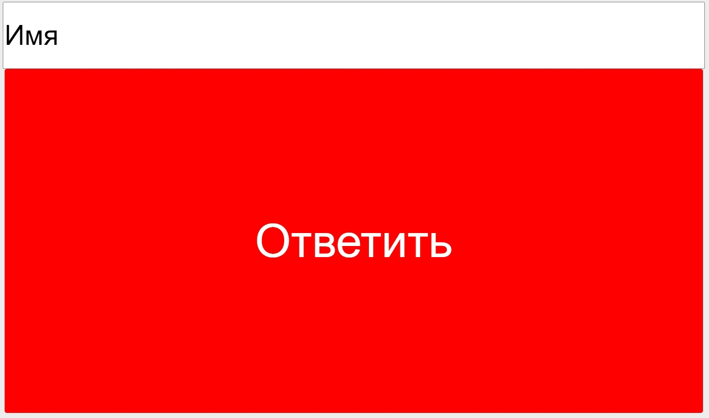
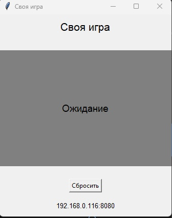

# SIGameOnlineButton

Симулятор кнопки как в телепередаче "Своя игра"

Как пользоваться:
После запуска программы - нужно перейти на созданный сайт.

Здесь каждый участник вписывает своё имя. И когда начнется вопрос и участник захочет ответить - он должен будет нажать на красную кнопку.
На компьютере, где был запущен файл появится окошко.

В данном окошке есть: Ссылка на сайт, кнопка "сбросить" участника и Текст по середине - на котором будет написано, кто первый нажал на кнопку. После того, как участник закончит свой ответ можно будет нажать на кнопку "сбросить" и после этого остальные участники тоже могут нажать на неё.

О программе:
Всё было сделано на скорую руку и имеет недостатки. Данная программа нужна для игры "Своя игра".
Её можно скачать по ссылке - https://vladimirkhil.com/si/simulator.

Как запустить:
Для запуска понадобится установить Python с сайта https://www.python.org/.
Желательно установить сразу же с PIP, так как придется скачивать дополнительные библиотеки.
После установки Python, нужно будет прописать в командной консоли "pip install flask".
В случае нехватки других библиотек также нужно воспользоваться PIP.

Далее запускается файл server.py любым удобным способом, например командой "python server.py"
В файле config.json можно вписать IP-адрес компьютера на котором будет запускаться файл и порт.
Но также данный файл может заполниться автоматически при запуске программы.

После запуска программы Появится окно, с ссылкой на сайт где будет находится кнопка.
Чтобы зайти на этот сайт нужно подключиться к одной локальной сети.
